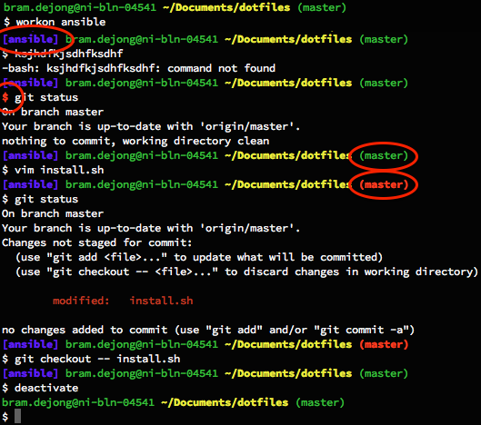

### Some More Dotfiles

- Python virtualenv name
- Return code coloring of "$"
- Git branch and branch status
- Full path

### Installing

```bash
git clone https://github.com/bdejong/dotfiles.git && dotfiles/install.sh
```


